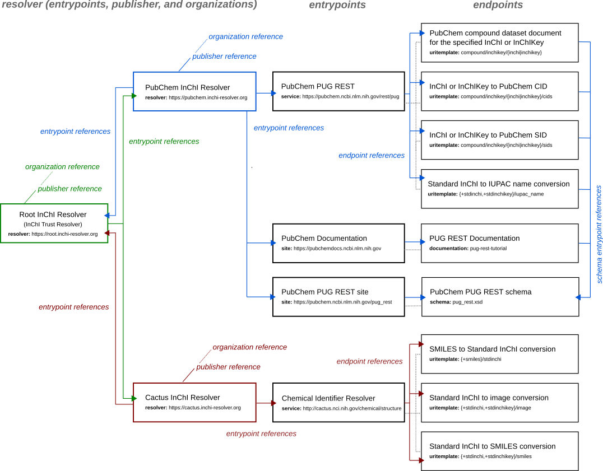

InChI Resolver Prototype system
===============================

A prototype system of three InChI Resolver APIs has been implemented in order to demonstrate
the interaction of different InChI Resolver instances based on the official protocol:

1) the (InChI Trust) Root InChI Resolver at `<https://root.inchi-resolver.org>`_
2) the PubChem InChI Resolver Instance at `<https://pubchem.inchi-resolver.org>`_
3) the InChI Resolver Instance of the NCI/CADD group, respectively the Chemical Structure Resolver at `<https://cactus.inchi-resolver.org>`_

Although they are currently hosted under the same domain, they are separately running instances of the
InChI Resolver reference implementation (each using their own subdomain).

The following image gives an overview:

Starting from the root resolver at `<https://root.inchi-resolver.org>`_, the top level of resource objects as required
by the `InChI Resolver Protocol <docs/inchi_resolver_protocol.rst>`_ are listed.